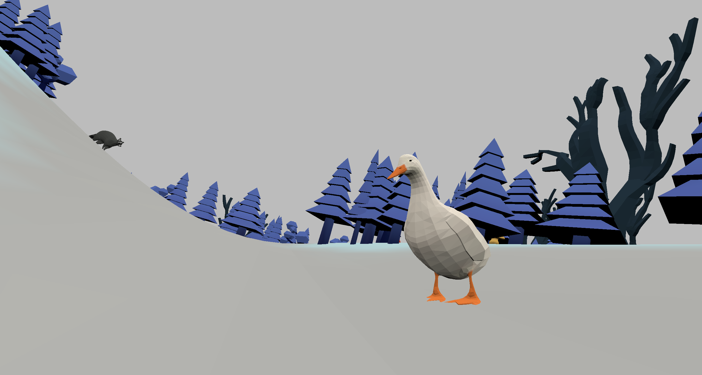

# waddlewaddle

Author: Sarah Di (sarahdi)

Design: My game is about counting the number of mushrooms for the duck and raccoon. You walk around the scene and try to find all of the mushrooms hidden around. There are some bully swans watching you though.

Screen Shot:

How To Play:

WASD to move around. Use mouse to control camera orientation. Escape to ungrab mouse.

(F, 1, 2, 3 buttons are used to interact with the raccoon and duck)

Sources: I made all assets myself. I also composed the music myself. The Font I used is Sixtyfour Convergence by Simon Cozens, Jens Kutílek; It is licensed under the Open Font License and I got the font from Google Fonts (however it doesn't show up on the screen right now due to a bug, so I use the DrawLines code).

This game was built with [NEST](NEST.md).

